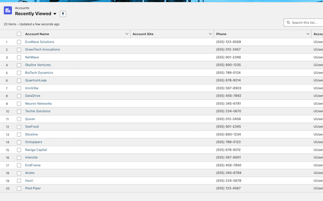
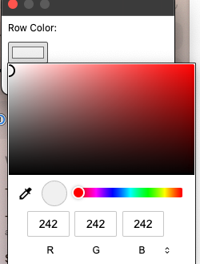

# Salesforce Zebra Tables

## Overview
Salesforce Zebra Tables is a Chrome extension that enhances the readability of Salesforce tables by applying zebra striping to the rows. This feature adds alternate background colors to the rows, improving visual scanning and reducing eye strain during extended work periods.

## Features
- **Automatic Zebra Striping:** Automatically applies zebra striping to all standard and custom Salesforce tables.
- **Customizable Colors:** Users can customize the colors used for the striping to suit their visual preferences or corporate branding.
- **Easy Toggle:** Enable or disable zebra striping quickly from the Chrome toolbar.

## Installation
Install Salesforce Zebra Tables directly from the Chrome Web Store:

Simply click the link above and select **Add to Chrome** to install the extension.

## Usage
Once installed, the extension will automatically apply zebra striping to any Salesforce table you view. You can toggle the striping on and off by clicking the extension icon in the Chrome toolbar.

## Customization
To customize the stripe colors:
1. Right-click the extension icon in the Chrome toolbar.
2. Select **Options**.
3. Use the color picker to choose your preferred stripe colors.
